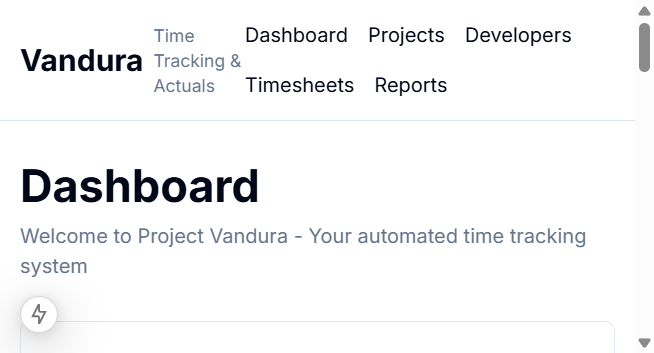
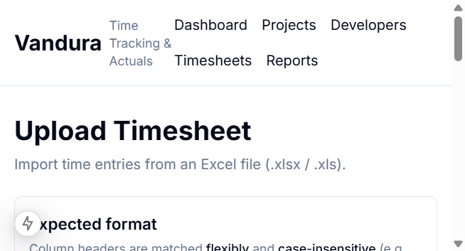
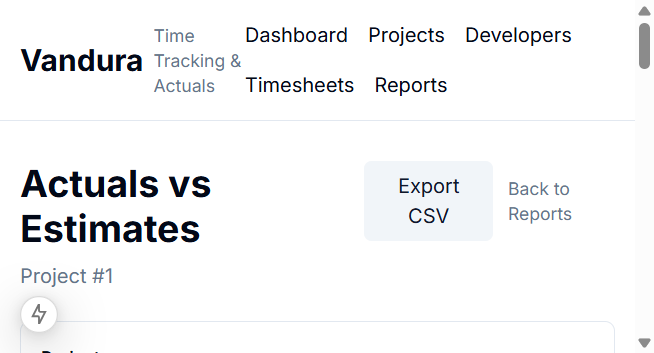

# Vandura

[](https://github.com/johnzervosdev/Vandura/actions/workflows/ci.yml)

**A time-tracking and reporting tool for project managers who live in Excel.**

Teams track time in spreadsheets. At the end of a sprint, a project manager compiles those sheets manually, calculates actuals, and compares them against estimates — a process that takes hours and is prone to mistakes. Vandura replaces that workflow with a web application that imports directly from Excel and generates accurate, up-to-date project reports instantly.

---

## What It Does

**Import timesheets from Excel**
Upload an `.xlsx` file and see a preview of what will be imported before anything is saved. Vandura parses each row, validates the data, flags issues as errors or warnings, and loads all entries into the database in a single transaction. It handles two common Excel timesheet layouts automatically, including weekly-grid formats where days of the week are columns rather than rows.

**Track projects and tasks**
Create projects with estimated hour budgets, break them into tasks with their own estimates, and set statuses. As timesheets are imported, actuals accumulate automatically — no manual rollup required.

**Actuals vs. Estimates Reports**
See exactly where each project stands: estimated hours vs. actual hours spent, broken down by task, with the variance color-coded green (under budget) or red (over budget). Filter by preset date ranges (Last 7 Days, This Month, All Time) or a custom date range. Tasks with no estimate show "N/A" rather than a misleading zero.

**Export to CSV**
One click to download the full report as a formatted spreadsheet, named and timestamped, ready to share with stakeholders.

**Dashboard**
An at-a-glance view of all active projects: total estimated hours, total hours logged, and overall variance — so problem projects surface the moment you log in.

---

## Screenshots

Captured from a local dev server (your tables and counts may differ after `db:seed`).

**Dashboard** (`/`)



**Excel upload** (`/timesheets/upload`)



**Actuals vs estimates** (`/reports/[projectId]`)



---

## Usage walkthrough (demo path)

Typical flow (**~5 minutes** with sample data). After `npm run db:seed`, use **Projects → project detail (tasks) → import → report → CSV**. You can also add time from **Timesheets** without Excel.

1. **Projects** (`/projects`) — open an existing project or **Create** one at `/projects/new` (name, budget, dates, status).

2. **Tasks** (`/projects/[id]`) — on the project page, add tasks and optional hour estimates so the report has baselines.

3. **Import** (`/timesheets/upload`) — choose an `.xlsx` / `.xls` file, **Parse** to preview rows, review errors/warnings in the expandable sections, then **Import** when valid. Use the committed blank template if you need a starting point: **[Download `/timesheet-template.xlsx`](public/timesheet-template.xlsx)** (served from `public/`). Full column rules and date/time behavior are documented on the upload page and in [README § Excel Format](#excel-format).

4. **Reports** (`/reports`) — pick a project to open **Actuals vs Estimates** (`/reports/[projectId]`). Adjust preset or custom date range.

5. **CSV** — on the report page, **Export CSV** downloads a timestamped file for Excel.

6. **Dashboard** (`/`) — optional check-in: active-project rollups and quick links.

**Optional:** **Timesheets** (`/timesheets`) — add or edit entries in the UI (no Excel required). **Developers** (`/developers`) — manage who appears in entry dropdowns. **Developer productivity** — link from `/reports`.

---

## Getting started

**Requirement:** Node.js **20+** ([nodejs.org](https://nodejs.org)).

```bash
# 1. Install dependencies
npm install

# 2. Local environment from .env.example
# macOS / Linux / Git Bash:
cp .env.example .env
# Windows Command Prompt:  copy .env.example .env
# Windows PowerShell:      Copy-Item .env.example .env

# 3. Apply database migrations (creates / updates ./data/vandura.db)
npm run db:migrate

# 4. (Optional) Sample projects, tasks, developers, and time entries
npm run db:seed

# 5. Start the dev server
npm run dev
```

Open [http://localhost:3000](http://localhost:3000).

**If you change the Drizzle schema** (`src/server/db/schema.ts`), generate SQL migrations before migrating:

```bash
npm run db:generate
npm run db:migrate
```

**Regenerate the committed Excel template** (writes `public/timesheet-template.xlsx`):

```bash
npm run generate:template
```

### Windows / OneDrive

The repo often lives under **OneDrive** on Windows; `next dev` can occasionally **hang** or show **chunk-load** issues when file watchers miss updates.

1. **Polling** — run dev with Watchpack polling:

```powershell
$env:WATCHPACK_POLLING="true"; $env:WATCHPACK_POLLING_INTERVAL="1000"; npm run dev
```

2. **Stale `.next`** — after switching Node versions or odd HMR behavior:

```powershell
Remove-Item -Recurse -Force .next; npm run dev
```

3. **Stuck process** — if the port is bound but the app does not respond, end stray `node.exe` tasks in Task Manager, clear `.next`, and restart (optionally with polling above).

**Future hardening:** scripted `dev:win` / `dev:clean` helpers are tracked as **Story 1.2** (deferred) in [`van/stories.md`](van/stories.md).

---

## Excel Format

The parser is flexible with column names. The expected layout is:

| Developer | Project | Task | Date | Start Time | End Time | Duration (min) | Notes |
|-----------|---------|------|------|------------|----------|----------------|-------|

Rules:
- Provide either **Duration (min)** or both **Start Time + End Time** — Vandura calculates whichever is missing
- Duration must be a multiple of **15 minutes**
- Missing developers, projects, or tasks are created automatically on import
- Importing the same file twice will create duplicate entries.
- All times are treated as local machine time (no timezone conversion).

Full column rules, date/time detail, and downloadable template: **Timesheets → Upload** (`/timesheets/upload`).

---

## Tech Stack

| Layer | Technology | What it does |
|-------|-----------|--------------|
| Framework | Next.js 15 + React 19 | Full-stack web framework — frontend and backend in one codebase |
| Language | TypeScript | Strict typing throughout; catches bugs at compile time, not runtime |
| API | tRPC | The frontend and backend share the same TypeScript types — no manual API contracts |
| Database | SQLite (`better-sqlite3`) | Embedded database, zero infrastructure, single-file backup |
| ORM | Drizzle | Type-safe database queries with SQL-like syntax and built-in migrations |
| UI | Tailwind CSS + shared components | Utility-first styling; `Modal`, `GlobalToastProvider`, and page-level layouts (no full shadcn/ui kit in-tree) |
| Validation | Zod | Runtime input validation with full TypeScript inference |

---

## Project Status

**Phase A — Complete ✅**
The full showcase path is functional: create a project → add tasks with estimates → import an Excel timesheet → view the Actuals vs. Estimates report → export to CSV.

**Phase B — Complete ✅**  
Manual time entry, developers, developer productivity report, Excel format + template, global error handling (`GlobalToastProvider`, production-safe tRPC errors, `not-found`), and this README / screenshots / architecture pass (Story 5.2).

**Phase B — remaining polish (optional)**  
README screenshots drift over time; rerun `npm run db:seed` and recapture if marketing needs fresher images.

**Quality checks**
Automated checks run in GitHub on every push to keep the project stable.

---

## Scripts

| Command | What it does |
|---------|-------------|
| `npm run dev` | Start the development server on [localhost:3000](http://localhost:3000) |
| `npm test` | Run the full test suite (`scripts/run-tests.mjs`; see `van/qa.md` for the file registry and shared-DB cleanup conventions) |
| `npm run type-check` | Run the TypeScript compiler without emitting — catches type errors across the whole project |
| `npm run build` | Production build |
| `npm run db:generate` | Generate Drizzle migration files after schema edits (`drizzle-kit generate`) |
| `npm run db:migrate` | Apply pending database migrations |
| `npm run db:seed` | Populate the database with sample data |
| `npm run db:studio` | Open Drizzle Studio — a browser-based database viewer |
| `npm run generate:template` | Regenerate `public/timesheet-template.xlsx` from `scripts/generate-timesheet-template.mjs` |

### Running a single test file

```bash
node --import tsx --test tests/date-utils.test.ts
```

Replace `date-utils.test.ts` with any file in the `tests/` folder. The test files use Node's built-in test runner — no additional test framework is needed.

---

## Project Documentation

Vandura was built using a structured process: user stories with acceptance criteria, Definition of Done checklists, QA sign-off per story, and a risk register. The planning and tracking documentation lives in the [`van/`](van/) folder for anyone interested in the project management approach behind the code.

## Technical Documentation

For the full technical breakdown — data model, service layer design, API endpoints, aggregation engine, key engineering decisions, and testing strategy — see [VANDURA_ARCHITECTURE.md](VANDURA_ARCHITECTURE.md).
